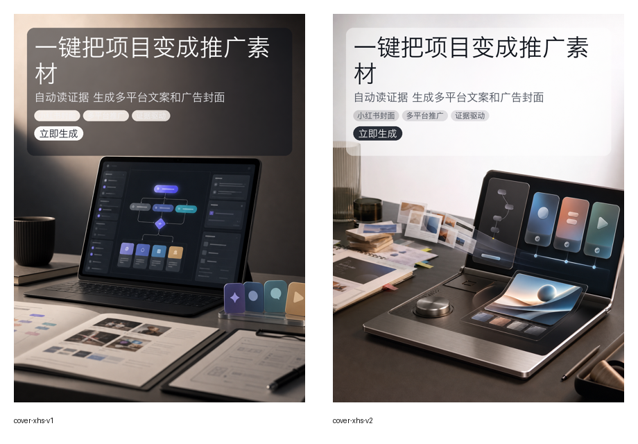
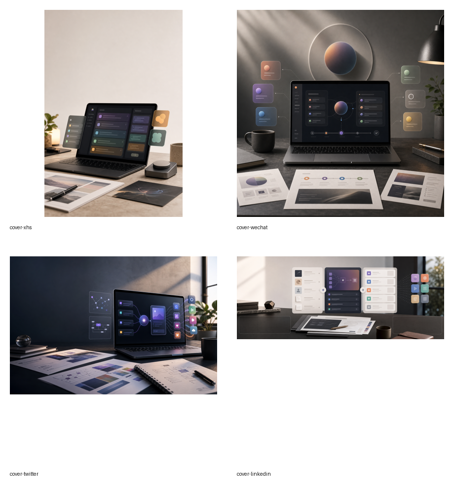
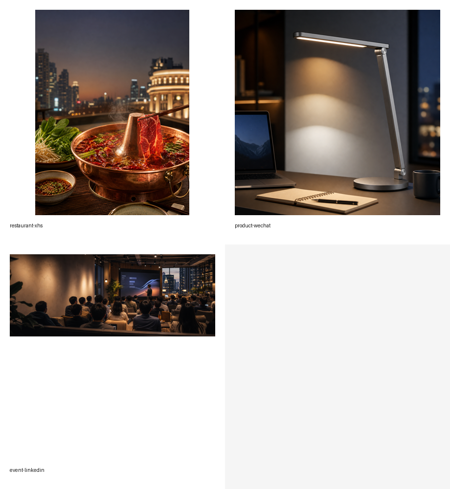

# Generated Ad Image Examples

These examples were generated with PromoAgent's interactive image brief flow and
local text overlay. The image model creates the clean visual background; PromoAgent
renders the headline, subhead, badges, and CTA locally so Chinese ad copy stays
sharp and readable.

## Interactive XHS Ad

Command shape:

```bash
python -m promoagent optimize . \
  --image \
  --image-platforms xhs \
  --image-interactive \
  --image-variants 2
```



Final single-cover example:


## Platform Covers

Prompt-only platform cover examples for XHS, WeChat, Twitter/X, and LinkedIn:



## Recommendation Task Demos

Examples for restaurant/local life, consumer product, and event promotion tasks:



